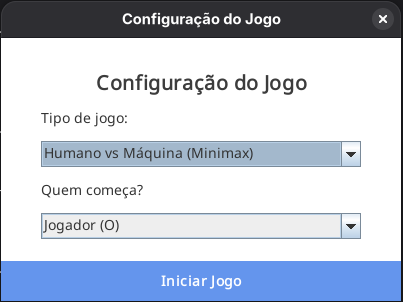
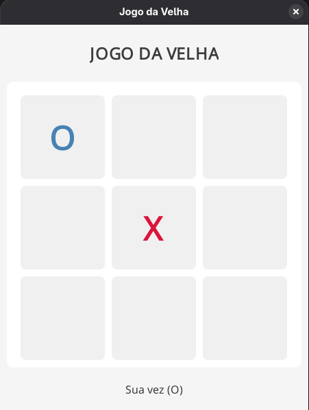

# Jogo da velha #


<div align="center">
  <table>
    <tr>
      <td align="center">
        
        <br>
        <sub><b>Menu Inicial</b></sub>
      </td>
      <td align="center">
        
        <br>
        <sub><b>Partida em Andamento</b></sub>
      </td>
    </tr>
  </table>
</div>

> Este projeto foi desenvolvido para a disciplina de **Inteligência Artificial**. Trata-se de uma implementação do clássico Jogo da Velha (Tic-Tac-Toe) com interface gráfica, focado na comparação entre dois tipos de agentes inteligentes: um baseado em busca exaustiva (Minimax) e outro em regras predefinidas (Heurística).

## Sobre o Projeto

O jogo permite configurar partidas entre **Humano vs Máquina**, oferecendo:

* **Interface Gráfica (GUI):** Desenvolvida em Java Swing para uma experiência visual interativa.
* **Seleção de Dificuldade/Algoritmo:** Escolha entre enfrentar o algoritmo Minimax (invencível) ou a Heurística.
* **Ordem de Jogada:** Configuração de quem inicia a partida (Jogador ou Máquina).

## Algoritmos Implementados

### 1. Minimax (O Invencível)
Este agente utiliza o algoritmo clássico de decisão para jogos de soma zero.
* **Funcionamento:** O algoritmo simula recursivamente todas as jogadas possíveis até o final do jogo (árvore de estados).
* **Lógica:** Ele maximiza a sua pontuação supondo que o adversário (o humano) jogará de forma a minimizar essa pontuação (jogada ótima).
* **Resultado:** É matematicamente impossível vencer este agente; o melhor resultado possível para o humano é o empate.

### 2. Heurística (Baseado em Regras)
Este agente toma decisões rápidas baseadas em uma lista de prioridades e padrões de tabuleiro, sem explorar toda a árvore de possibilidades.
* **Estratégia:**
    1.  **Vitória Imediata:** Verifica se pode ganhar nesta rodada.
    2.  **Bloqueio:** Identifica padrões de perigo (duas peças do adversário em linha) e bloqueia a posição.
    3.  **Estratégia Posicional:** Prioriza o centro, depois os cantos e, por fim, as laterais.

## Ferramentas Utilizadas

- Java
- Java Swing (JFrame, JPanel, Graphics2D)

## Executando o Projeto

Siga as instruções abaixo para executar o projeto em seu ambiente local:

1. **Clone o repositório:**

   ```
   git clone https://github.com/Hyocas/jogo-da-velha.git
   ```

2. **Navegue até o diretório do projeto:**

   ```
   cd jogo-da-velha/src
   ```

3. **Compile os arquivos:**

   ```
   javac *.java
   ```

4. **Execute o arquivo:**

   ```
   java JogoDaVelha
   ```

## Autor

- Leandro Balbino
